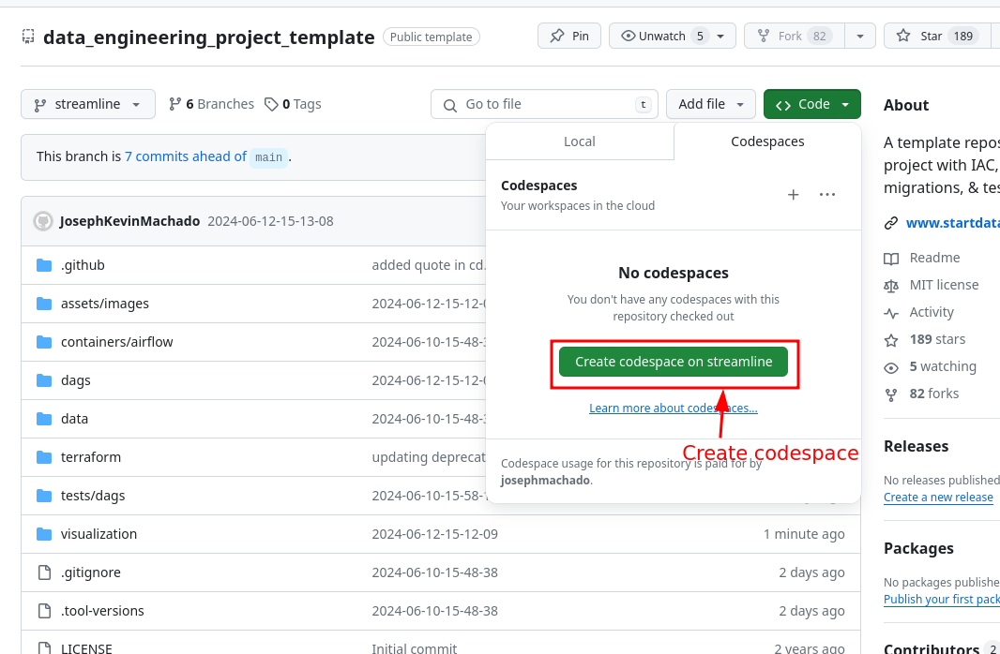
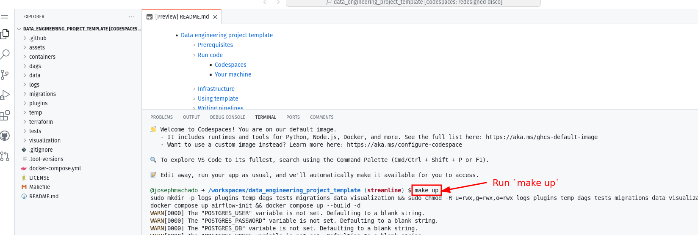

* [Change Data Capture](#change-data-capture)
* [Project Design](#project-design)
* [Run on codespaces](#run-on-codespaces)
* [Prerequisites](#prerequisites)
* [Setup](#setup)
* [Analyze data with duckDB](#analyze-data-with-duckdb)
* [References](#references)
    * [duckDB](#duckdb)
* [Project Design](#project-design-1)

# Change Data Capture

Repository for the [Change Data Capture with Debezium](https://www.startdataengineering.com/post/change-data-capture-using-debezium-kafka-and-pg/) blog at startdataengineering.com.

# Project Design

# Run on codespaces

You can run this CDC data pipeline using GitHub codespaces. Follow the instructions below.

1. Create codespaces by going to the **[change_data_capture](https://github.com/josephmachado/change_data_capture)** repository, cloning(or fork) it and then clicking on `Create codespaces on main` button.
2. Wait for codespaces to start, then in the terminal type `make up && sleep 60 && make connectors && sleep 60`.
3. Wait for the above to complete, it can take up a couple of minutes.
4. Go to the `ports` tab and click on the link exposing port `9001` to access Minio (open source S3) UI.
5. In the minio UI, use `minio`, and `minio123` as username and password respectively. In the minio UI you will be able to see the the paths `commerce/debezium.commerce.products` and `commerce/debezium.commerce.users` paths, which have json files in them. The json files contain data about the create, updates and deletes in the respective products and users tables.

**NOTE**: The screenshots below, show the general process to start codespaces, please follow the instructions shown above for this project.





**Note** Make sure to switch off codespaces instance, you only have limited free usage; see docs [here](https://github.com/features/codespaces#pricing).


# Prerequisites

1. [git version >= 2.37.1](https://github.com/git-guides/install-git)
2. [Docker version >= 20.10.17](https://docs.docker.com/engine/install/) and [Docker compose v2 version >= v2.10.2](https://docs.docker.com/compose/#compose-v2-and-the-new-docker-compose-command). Make sure that docker is running using `docker ps`
3. [pgcli](https://www.pgcli.com/install)

**Windows users**: please setup WSL and a local Ubuntu Virtual machine following **[the instructions here](https://ubuntu.com/tutorials/install-ubuntu-on-wsl2-on-windows-10#1-overview)**. Install the above prerequisites on your ubuntu terminal; if you have trouble installing docker, follow **[the steps here](https://www.digitalocean.com/community/tutorials/how-to-install-and-use-docker-on-ubuntu-22-04#step-1-installing-docker)** (only Step 1 is necessary). Please install the make command with `sudo apt install make -y` (if its not already present). 

# Setup

All the commands shown below are to be run via the terminal (use the Ubuntu terminal for WSL users). We will use docker to set up our containers. Clone and move into the lab repository, as shown below.

```bash
git clone https://github.com/josephmachado/change_data_capture.git
cd change_data_capture
```

We have some helpful make commands to make working with our systems more accessible. Shown below are the make commands and their definitions

1. **make up**: Spin up the docker containers for Postgres, data generator, Kafka Connect, Kafka, & minio (open source S3 alternative). Note this also sets up [Postgres tables](./postgres/init.sql) and starts a [python script](./datagen/gen_user_payment_data.py) to create-delete-update rows in those tables.
2. **make conenctors**: Set up the debezium connector to start recording changes from Postgres and another connector to push this data into minio.
3. **make down**: Stop the docker containers.

You can see the commands in [this Makefile](./Makefile). If your terminal does not support **make** commands, please use the commands in [the Makefile](./Makefile) directly. All the commands in this book assume that you have the docker containers running.

In your terminal, do the following:

```bash
# Make sure docker is running using docker ps
make up # starts the docker containers
sleep 60 # wait 1 minute for all the containers to set up
make connectors # Sets up the connectors
sleep 60 # wait 1 minute for some data to be pushed into minio
make minio-ui # opens localhost:9001
```

In the minio UI, use `minio`, and `minio123` as username and password respectively. In the minio UI you will be able to see the the paths `commerce/debezium.commerce.products` and `commerce/debezium.commerce.users` paths, which have json files in them. The json files contain data about the create, updates and deletes in the respective products and users tables.

# Analyze data with duckDB

We [mount a local folder to minio container](./docker-compose.yml) which allows us to access the data in minio via filesystem. We can start a duckDB shell as shown below

```bash
./duckdb
```

Now let's create a SCD2 for `products` table from the data we have in minio. Note we are only looking at rows that have updates and deletes in them (see the `where id in` filter in the below query). If the query is not working, try pasting the query line by line.

```sql
WITH products_create_update_delete AS (
    SELECT
        COALESCE(CAST(json->'value'->'after'->'id' AS INT), CAST(json->'value'->'before'->'id' AS INT)) AS id,
        json->'value'->'before' AS before_row_value,
        json->'value'->'after' AS after_row_value,
        CASE
            WHEN CAST(json->'value'->'$.op' AS CHAR(1)) = '"c"' THEN 'CREATE'
            WHEN CAST(json->'value'->'$.op' AS CHAR(1)) = '"d"' THEN 'DELETE'
            WHEN CAST(json->'value'->'$.op' AS CHAR(1)) = '"u"' THEN 'UPDATE'
            WHEN CAST(json->'value'->'$.op' AS CHAR(1)) = '"r"' THEN 'SNAPSHOT'
            ELSE 'INVALID'
        END AS operation_type,
        CAST(json->'value'->'source'->'lsn' AS BIGINT) AS log_seq_num,
        epoch_ms(CAST(json->'value'->'source'->'ts_ms' AS BIGINT)) AS source_timestamp
    FROM
        read_ndjson_objects('minio/data/commerce/debezium.commerce.products/*/*/*.json')
    WHERE
        log_seq_num IS NOT NULL
)
SELECT
    id,
    CAST(after_row_value->'name' AS VARCHAR(255)) AS name,
    CAST(after_row_value->'description' AS TEXT) AS description,
    CAST(after_row_value->'price' AS NUMERIC(10, 2)) AS price,
    source_timestamp AS row_valid_start_timestamp,
    CASE 
        WHEN LEAD(source_timestamp, 1) OVER lead_txn_timestamp IS NULL THEN CAST('9999-01-01' AS TIMESTAMP) 
        ELSE LEAD(source_timestamp, 1) OVER lead_txn_timestamp 
    END AS row_valid_expiration_timestamp
FROM products_create_update_delete
WHERE id in (SELECT id FROM products_create_update_delete GROUP BY id HAVING COUNT(*) > 1)
WINDOW lead_txn_timestamp AS (PARTITION BY id ORDER BY log_seq_num )
ORDER BY id, row_valid_start_timestamp
LIMIT
    200;

.exit; -- exit the cli
```

# References

1. [Debezium postgre docs](https://debezium.io/documentation/reference/2.1/connectors/postgresql.html)
2. [Redpanda CDC example](https://redpanda.com/blog/redpanda-debezium)
3. [duckDB docs](https://duckdb.org/docs/archive/0.2.9/)
4. [Kafka docs](https://kafka.apache.org/20/documentation.html)


<!-- Send message to kafka
CASE WHEN LEAD(source_timestamp, 1) OVER(PARTITION BY id ORDER BY log_seq_num ) IS NULL THEN CAST('9999-01-01' AS TIMESTAMP) ELSE 
./kafka_2.13-3.4.0/bin/kafka-console-producer.sh --bootstrap-server 127.0.0.1:9093 --topic test

./kafka_2.13-3.4.0/bin/kafka-console-consumer.sh --bootstrap-server 127.0.0.1:9093 --topic test --from-beginning

List topics
./kafka_2.13-3.4.0/bin/kafka-topics.sh --bootstrap-server 127.0.0.1:9093 --list

./kafka_2.13-3.4.0/bin/kafka-console-consumer.sh --bootstrap-server 127.0.0.1:9093 --topic debezium.commerce.products --from-beginning --max-messages 1

./kafka_2.13-3.4.0/bin/kafka-console-consumer.sh --bootstrap-server 127.0.0.1:9093 --topic debezium.commerce.users --from-beginning --max-messages 1

connect to postgres

pgcli -h localhost -p 5432 -U postgres -d postgres

SET search_path TO commerce;
INSERT INTO users(username, password) SELECT 'Joseph', 'Password1234';

INSERT INTO products (name, description, price) SELECT 'Product', 'Some desc', 100;

Check for connectors

curl -H "Accept:application/json" localhost:8083/connectors/
curl -H "Accept:application/json" "localhost:8083/connectors?expand=status"	| jq .

Setup connectors

curl -i -X POST -H "Accept:application/json" -H "Content-Type:application/json" localhost:8083/connectors/ -d '@./connectors/pg-src-connector.json'

curl -i -X POST -H "Accept:application/json" -H "Content-Type:application/json" localhost:8083/connectors/ -d '@./connectors/s3-sink.json'

1. postgres connector

curl -i -X POST -H "Accept:application/json" -H "Content-Type:application/json" localhost:8083/connectors/ -d '@./connectors/pg-src-connector.json'

check wal level
`select * from pg_settings where name ='wal_level';

docker compose down -v

2. S3 sink connector

curl -i -X POST -H "Accept:application/json" -H "Content-Type:application/json" localhost:8083/connectors/ -d '@./connectors/s3-sink-connector.json'


curl -i -X POST -H  "Content-Type:application/json" localhost:8083/connectors/s3-sink-connector/config -d '@./connectors/s3-sink-connector.json'

curl -i -X PUT -H  "Content-Type:application/json" localhost:8083/connectors/s3-sink-connector/config -d '@./connectors/s3-sink-connector.json'

curl -i -X PUT -H  "Content-Type:application/json" localhost:8083/connectors/ -d '@./connectors/s3-sink-connector-2.json'

curl -i -X POST -H "Accept:application/json" -H "Content-Type:application/json" localhost:8083/connectors/ -d '@./connectors/s3-sink.json'

curl -i -X POST -H "Accept:application/json" -H "Content-Type:application/json" localhost:8083/connectors/ -d '@./connectors/s3-sink-2.json'

## duckDB

wget https://github.com/duckdb/duckdb/releases/download/v0.7.0/duckdb_cli-osx-universal.zip
unzip duckdb_cli-osx-universal.zip
./duckdb

```sql
SELECT * FROM 'sample.json';
SELECT * FROM 'sample_2.json';
SELECT value as dbz_payload FROM 'minio/data/commerce/debezium.commerce.products/2023-03-01/11/0000000000-00000000000000000000.json';

WITH commerce_cud AS (SELECT value as dbz_payload FROM 'minio/data/commerce/debezium.commerce.products/*/*/*.json')
SELECT *
FROM commerce_cud
LIMIT 2
;

columns={value: 'STRUCT'}, goose: 'INTEGER[]', swan: 'DOUBLE'}

{"value":{"before":null,"after":{"id":66,"name":"Veronica Roberts","description":"Treat one role individual activity gun. Let toward fine music argue common ago. Director environmental over always. National find prevent religious finally.","price":"DOQ="},"source":{"version":"2.2.0.Alpha2","connector":"postgresql","name":"debezium","ts_ms":1677669284960,"snapshot":"false","db":"postgres","sequence":"[\"23137176\",\"23137328\"]","schema":"commerce","table":"products","txId":811,"lsn":23137328,"xmin":null},"op":"c","ts_ms":1677669285154,"transaction":null}}

SELECT * FROM read_ndjson_objects('minio/data/commerce/debezium.commerce.products/*/*/*.json');

SELECT json_type(*) FROM read_ndjson_objects('minio/data/commerce/debezium.commerce.products/*/*/*.json');

WITH commerce_cud AS (SELECT 
COALESCE(CAST(json->'value'->'after'->'id' AS INT), CAST(json->'value'->'before'->'id' AS INT)) AS id
, json->'value'->'before' as before_row_value
, json->'value'->'after' as after_row_value
, CASE 
WHEN CAST(json->'value'->'$.op' AS CHAR(1)) = '"c"' THEN 'CREATE'
WHEN CAST(json->'value'->'$.op' AS CHAR(1)) = '"d"' THEN 'DELETE'
WHEN CAST(json->'value'->'$.op' AS CHAR(1)) = '"u"' THEN 'UPDATE'
WHEN CAST(json->'value'->'$.op' AS CHAR(1)) = '"r"' THEN 'SNAPSHOT'
ELSE 'INVALID' END as operation_type
, CAST(json->'value'->'source'->'lsn' AS BIGINT) as log_seq_num
, epoch_ms(CAST(json->'value'->'source'->'ts_ms' AS BIGINT)) as source_timestamp
FROM read_ndjson_objects('minio/data/commerce/debezium.commerce.products/*/*/*.json')
where log_seq_num is not null)
SELECT 
id
, log_seq_num
, operation_type
, source_timestamp as row_valid_start_timestamp
, LEAD(source_timestamp, 1) OVER(PARTITION BY id ORDER BY log_seq_num) as row_valid_expiration_timestamp
, ROW_NUMBER() OVER(PARTITION BY id ORDER BY log_seq_num) AS op_order
FROM commerce_cud
order by log_seq_num
 LIMIT 200;

```

# Project Design
-->
